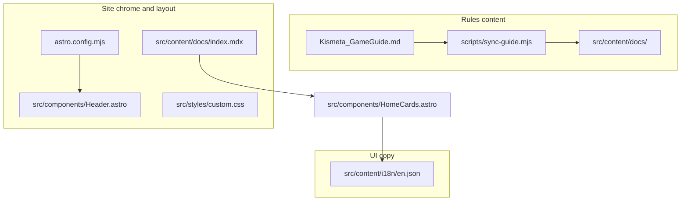

# Maintainer guide: where to update what

Task-oriented map for the Kismeta Rules Wiki. Use this when you need to change layout, navigation, styling, rules text, translations, or deploy settings — without hunting through the repo.

**Stack:**
[Astro](https://astro.build) 6 +
[Starlight](https://starlight.astro.build).
Custom UI overrides Starlight via `astro.config.mjs` → `components.Header`.



---

## Quick lookup

**Jump to:**
[Home](#home--landing-page)
[Navigation](#navigation--chrome)
[Rules](#rules-content)
[Glossary](#glossary)
[Theme](#theme--brand)
[Deploy](#deploy--config)

Paths are repo-relative. Details for the home page, sync workflow, and new pages are in the sections below.

### Home & landing page

- **Hero** (tagline, logo, CTA buttons)  
  `src/content/docs/index.mdx` · `src/content/docs/pt-br/index.mdx`  
  Edit `hero:` in frontmatter (`splash` template). Buttons: `hero.actions`.

- **Feature cards** (“How to use this site”)  
  Layout: `src/components/HomeCards.astro`  
  Copy: `src/content/i18n/en.json` and `pt-BR.json` (`home.card.*`; keys in `src/content.config.ts`).

→ More detail: [Home page layout](#home-page-layout)

### Navigation & chrome

- **Top tabs** (Learn / Play / Reference / Glossary)  
  `src/components/TabNav.astro` (URLs in `tabs` array) · labels: i18n `tab.*` · styles: `src/styles/custom.css` (`.tab-nav`)

- **Game mode toggles** (Quickplay / Magnus)  
  `src/components/GameModeToggle.astro` · labels: i18n `gameMode.*`  
  Rule callouts: `.game-mode-callout` in synced markdown (see [Game mode callouts](#game-mode-callouts-in-rules)).

- **Header** (search, theme, locale + tabs + toggles)  
  `src/components/Header.astro` — wraps Starlight header + `TabNav` + `GameModeToggle`.

- **Left sidebar** (page list, order, labels)  
  `astro.config.mjs` → `starlight.sidebar`  
  New compendium page: add a `link()` here **and** a slug in `scripts/sync-guide.mjs`.

### Rules content

- **Rules, compendium, play pages**  
  `Kismeta_GameGuide.md` → run `npm run sync`  
  Output: `src/content/docs/learn/`, `play/`, `reference/`. Do not hand-edit those folders unless you accept overwrite on the next sync.

- **Sync script** (slugs, draft banners, cross-links, ⚙️ callouts)  
  `scripts/sync-guide.mjs` — `SECTION_META`, `COMPENDIUM_SLUGS`, `DRAFT_NOTICES`, `SEE_LINKS`.

→ Workflow: [Generated vs hand-edited](#generated-vs-hand-edited-content) · New page: [Adding a sidebar page](#adding-a-new-sidebar-page)

### Glossary

- **Term definitions** (auto-generated)  
  `src/data/glossary.json` via `npm run sync`

- **Glossary page layout**  
  `src/content/docs/glossary.mdx` · `src/components/GlossaryList.astro`

- **Link a term to a compendium page**  
  `src/components/GlossaryList.astro` → `termLinks`

- **Glossary intro text**  
  i18n `glossary.intro` · `src/components/GlossaryIntro.astro`

### Translations

- **Portuguese rules and UI**  
  See [i18n.md](./i18n.md) — `npm run sync:pt`, `src/content/docs/pt-br/`, `scripts/term-glossary-pt.json`

### Theme & brand

- **Colors, fonts, spacing, print**  
  `src/styles/custom.css` — `--kismeta-*`, `--sl-color-*`, `.kismeta-header-wrap`

- **Logo, favicon, fonts in `<head>`**  
  `astro.config.mjs` (`title`, `logo`, `favicon`, `head[]`) · logo file: `src/assets/logo.svg`

- **Brand asset files**  
  [public/brand/README.md](../public/brand/README.md) — also `public/fonts/`, `public/favicon.svg`

- **Lore page font (Amarante)**  
  Wrap content in `<div class="kismeta-lore">` — see [Lore typography](#lore-typography)

### Deploy & config

- **Production URL**  
  `astro.config.mjs` → `site` (currently `https://kismeta.goodmagik.com`)

- **PWA / offline install**  
  `astro.config.mjs` → `vite.plugins` (`VitePWA`) · `public/registerSW.js`

- **Vercel build**  
  `vercel.json` — `npm run build`, output `dist/`

---

## Home page layout

The landing page uses Starlight’s **splash** template.
| ----------------------------------------------------------------------------------- |
| ++ TEMPLATE ++ -------------------------------------------------------------------- |
| + Area ---------------------------------------------------------------------------- |
| + File ---------------------------------------------------------------------------- |
| + What to edit -------------------------------------------------------------------- |
| ----------------------------------------------------------------------------------- |
| + Hero title, tagline, logo, CTA buttons ------------------------------------------ |
| + `src/content/docs/index.mdx` (EN), `src/content/docs/pt-br/index.mdx` (PT) ------ |
| + Frontmatter: `template: splash`, `hero.tagline`, `hero.image`, `hero.actions` --- |
| ----------------------------------------------------------------------------------- |
| + Feature cards below hero -------------------------------------------------------- |
| + `src/components/HomeCards.astro` ------------------------------------------------ |
| + Grid layout and which cards appear ---------------------------------------------- |
| ----------------------------------------------------------------------------------- |
| + Card text ----------------------------------------------------------------------- |
| + `src/content/i18n/en.json` / `pt-BR.json` --------------------------------------- |
| + Keys `home.sectionTitle`, `home.card.*`, `home.footer` -------------------------- |
| ----------------------------------------------------------------------------------- |
**Hero example (English):**

```yaml
---
title: Kismeta Rules
template: splash
hero:
  tagline: Alchemists of the Great Year — rules wiki for players at the table.
  image:
    file: ../../assets/logo.svg
  actions:
    - text: Start learning
      link: /learn/lore/
    - text: Round at a glance
      link: /play/round-at-a-glance/
      variant: minimal
---
import HomeCards from '../../components/HomeCards.astro';

<HomeCards />
```

**Important:** `en.json` also defines `home.tagline` and `home.action.learn` / `home.action.round`, but the hero currently reads from **frontmatter**, not those i18n keys. When changing hero copy, edit **both** locale `index.mdx` files (or refactor hero to use i18n — not done today).

---

## Generated vs hand-edited content

| Safe to edit directly                                                                          | Overwritten by `npm run sync`                                     |
| ---------------------------------------------------------------------------------------------- | ----------------------------------------------------------------- |
| `index.mdx`, `glossary.mdx`, `src/components/*`, `src/styles/*`, `astro.config.mjs`, i18n JSON | Most files under `src/content/docs/learn/`, `play/`, `reference/` |
| `Kismeta_GameGuide.md` (source of truth)                                                       | `src/data/glossary.json`                                          |

**Typical rules workflow:** edit `Kismeta_GameGuide.md` → `npm run sync` → `npm run dev` → preview → `npm run build` for production.

---

## Adding a new sidebar page

When you add a compendium section or other synced doc:

1. Add the section to [`Kismeta_GameGuide.md`](../Kismeta_GameGuide.md) with the heading name the sync script expects.
2. Map heading → URL slug in [`scripts/sync-guide.mjs`](../scripts/sync-guide.mjs) (`COMPENDIUM_SLUGS` or `SECTION_META`).
3. Add a sidebar entry in [`astro.config.mjs`](../astro.config.mjs) using `link()` (English label + `pt-BR` translation).
4. Run `npm run sync` (and `npm run sync:pt` if you maintain Portuguese).
5. Optionally update:
   - `SEE_LINKS` in `sync-guide.mjs` (internal “See Compendium …” links)
   - `termLinks` in `GlossaryList.astro`
   - `DRAFT_NOTICES` in `sync-guide.mjs` (WIP banner at top of a page)

---

## Game mode callouts in rules

Lines with ⚙️ in the guide are converted during sync to:

```html
<div class="game-mode-callout" data-modes="quickplay magnus">...</div>
```

- **Show/hide:** [`GameModeToggle.astro`](../src/components/GameModeToggle.astro) toggles elements by `data-modes` (`quickplay`, `magnus`).
- **Generation logic:** [`scripts/sync-guide.mjs`](../scripts/sync-guide.mjs).
- **Styling:** [`src/styles/custom.css`](../src/styles/custom.css) → `.game-mode-callout`.

---

## Lore typography

[`src/styles/custom.css`](../src/styles/custom.css) uses the Amarante font when markdown is wrapped in `<div class="kismeta-lore">`. The sync script does **not** add this wrapper automatically. To use lore styling on a page, add the wrapper in the guide (if sync preserves it) or in a hand-maintained doc.

---

## Brand assets

See [`public/brand/README.md`](../public/brand/README.md).

| Asset                     | Typical path                                              |
| ------------------------- | --------------------------------------------------------- |
| Logo                      | `src/assets/logo.svg` (referenced in `astro.config.mjs`)  |
| Favicon                   | `public/favicon.svg`                                      |
| Body fonts (Futura)       | `public/fonts/` (referenced in `custom.css` `@font-face`) |
| Title/lore fonts (Google) | Loaded in `astro.config.mjs` → `head[]`                   |
| PWA icons                 | `astro.config.mjs` → `VitePWA` manifest `icons`           |

After changing icons or manifest fields, run `npm run build` and confirm install/offline behavior.

---

## Commands

| Command               | Purpose                                                              |
| --------------------- | -------------------------------------------------------------------- |
| `npm run dev`         | Local dev server ([http://localhost:4321](http://localhost:4321))    |
| `npm run sync`        | `Kismeta_GameGuide.md` → English pages + `glossary.json`             |
| `npm run sync:pt`     | Machine-translate `pt-br` content (needs `OPENAI_API_KEY` in `.env`) |
| `npm run sync:all`    | `sync` then `sync:pt`                                                |
| `npm run scaffold:pt` | Empty pt-br frontmatter stubs                                        |
| `npm run build`       | Runs `sync`, then production build → `dist/`                         |
| `npm run preview`     | Preview production build locally                                     |

---

## Repo map (high level)

```
Kismeta_GameGuide.md          # Canonical rules — edit first
scripts/sync-guide.mjs        # Guide → Starlight markdown + glossary JSON
scripts/translate-locale.mjs  # pt-br translation (see docs/i18n.md)
astro.config.mjs              # Starlight: sidebar, locales, logo, PWA, site URL
src/content/docs/             # Pages (most generated; index + glossary are manual)
src/content/i18n/             # UI strings (tabs, home cards, glossary intro)
src/components/               # Header, TabNav, GameModeToggle, HomeCards, Glossary*
src/styles/custom.css         # Theme and layout overrides
src/data/glossary.json        # Glossary entries (generated)
public/                       # favicon, brand/, fonts/, registerSW.js
```

---

## Related docs

- [README.md](../README.md) — quick start, deploy, rules sync summary
- [i18n.md](./i18n.md) — Portuguese workflow, term glossary, adding locales
