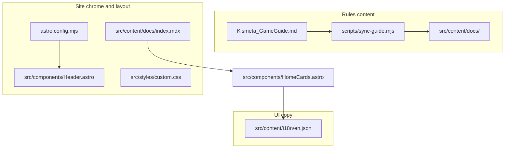

# Maintainer guide: where to update what

Task-oriented map for the Kismeta Rules Wiki. Use this when you need to change layout, navigation, styling, rules text, translations, or deploy settings — without hunting through the repo.

**Stack:**
[Astro](https://astro.build) 6 +
[Starlight](https://starlight.astro.build).
Custom UI overrides Starlight via `astro.config.mjs` → `components.Header`.



---

## Quick lookup

**Jump to:**
[Home](#home--landing-page)
[Navigation](#navigation--chrome)
[Rules](#rules-content)
[Glossary](#glossary)
[Theme](#theme--brand)
[Deploy](#deploy--config)

Paths are repo-relative. Details for the home page, sync workflow, and new pages are in the sections below.

### Home & landing page

- **Hero** (tagline, logo, CTA buttons)  
  `src/content/docs/index.mdx`  
  Edit `hero:` in frontmatter (`splash` template). Buttons: `hero.actions`.

- **Feature cards** (“How to use this site”)  
  Layout: `src/components/HomeCards.astro`  
  Copy: `src/content/i18n/en.json` (`home.card.*`; keys in `src/content.config.ts`).

→ More detail: [Home page layout](#home-page-layout)

### Navigation & chrome

- **Top tabs** (Play / Rules / Lore)  
  `src/components/TabNav.astro` (URLs in `tabs` array) · labels: i18n `tab.play`, `tab.rules`, `tab.lore` · styles: `src/styles/custom.css` (`.tab-nav`)  
  **Play** is active for `/play/*` except `/play/setup/` and `/play/round-overview/` (and the home page `/`), `/glossary/`, `/reference/*`. **Rules** is active for `/learn/*`, `/rules/*`, `/play/setup/`, `/play/round-overview/`. **Lore** is active for `/lore/*`.

- **Game mode callouts** (Quickplay / Magnus ⚙️ in rules)  
  Set in Guided Play at start; persisted in `localStorage` (`kismeta-game-modes`).  
  Applied site-wide by [`src/scripts/game-modes.ts`](../src/scripts/game-modes.ts) (see [Game mode callouts](#game-mode-callouts-in-rules)).

- **Header** (search, theme, locale + tabs)  
  `src/components/Header.astro` — wraps Starlight header + `TabNav`.

- **Left sidebar** (page list, order, labels)  
  `astro.config.mjs` → `starlight.sidebar`  
  New reference page: add a `link()` here (under the Rules group) **and** a `SECTION_META` entry in `scripts/sync-guide.mjs`.

### Rules content

- **Rules and play pages**  
  `Kismeta_GameGuide.md` → run `npm run sync`  
  Output: `src/content/docs/learn/`, `play/`, `reference/`, `rules/`. Do not hand-edit those folders unless you accept overwrite on the next sync.

- **Sync script** (slugs, draft banners, cross-links, ⚙️ callouts)
  `scripts/sync-guide.mjs` — `SECTION_META`, `DRAFT_NOTICES`, `SEE_LINKS`.

→ Workflow: [Generated vs hand-edited](#generated-vs-hand-edited-content) · New page: [Adding a sidebar page](#adding-a-new-sidebar-page)

### Glossary

- **Term definitions** (auto-generated)  
  `src/data/glossary.json` via `npm run sync`

- **Glossary page layout**  
  `src/content/docs/glossary.mdx` · `src/components/GlossaryList.astro`

- **Link a term to a rules page**  
  `src/components/GlossaryList.astro` → `termLinks`

- **Glossary intro text**  
  i18n `glossary.intro` · `src/components/GlossaryIntro.astro`

### Translations

- **Adding a locale**  
  See [i18n.md](./i18n.md) — Starlight `locales`, mirrored `src/content/docs/<locale>/`, `translate-locale.mjs`

### Theme & brand

- **Colors, fonts, spacing, print**  
  `src/styles/custom.css` — `--kismeta-*`, `--sl-color-*`, `.kismeta-header-wrap`

- **Logo, favicon, fonts in `<head>`**  
  `astro.config.mjs` (`title`, `logo`, `favicon`, `head[]`) · logo file: `src/assets/logo.svg`

- **Brand asset files**  
  [public/brand/README.md](../public/brand/README.md) — also `public/fonts/`, `public/favicon.svg`

- **Lore page font (Amarante)**  
  Wrap content in `<div class="kismeta-lore">` — see [Lore typography](#lore-typography)

### Deploy & config

- **Production URL**  
  `astro.config.mjs` → `site` (currently `https://kismeta.goodmagik.com`)

- **PWA / offline install**  
  `astro.config.mjs` → `vite.plugins` (`VitePWA`) · `public/registerSW.js`

- **Vercel build**  
  `vercel.json` — `npm run build`, output `dist/`

---

## Home page layout

The landing page uses Starlight’s **splash** template.
| ----------------------------------------------------------------------------------- |
| ++ TEMPLATE ++ -------------------------------------------------------------------- |
| + Area ---------------------------------------------------------------------------- |
| + File ---------------------------------------------------------------------------- |
| + What to edit -------------------------------------------------------------------- |
| ----------------------------------------------------------------------------------- |
| + Hero title, tagline, logo, CTA buttons ------------------------------------------ |
| + `src/content/docs/index.mdx` --------------------------------------------------- |
| + Frontmatter: `template: splash`, `hero.tagline`, `hero.image`, `hero.actions` --- |
| ----------------------------------------------------------------------------------- |
| + Feature cards below hero -------------------------------------------------------- |
| + `src/components/HomeCards.astro` ------------------------------------------------ |
| + Grid layout and which cards appear ---------------------------------------------- |
| ----------------------------------------------------------------------------------- |
| + Card text ----------------------------------------------------------------------- |
| + `src/content/i18n/en.json` ------------------------------------------------------ |
| + Keys `home.sectionTitle`, `home.card.*`, `home.footer` -------------------------- |
| ----------------------------------------------------------------------------------- |
**Hero example (English):**

```yaml
---
title: Kismeta Rules
template: splash
hero:
  tagline: Alchemists of the Great Year — rules wiki for players at the table.
  image:
    file: ../../assets/logo.svg
  actions:
    - text: Start learning
      link: /learn/lore/
    - text: Round at a glance
      link: /rules/round-at-a-glance/
      variant: minimal
---
import HomeCards from '../../components/HomeCards.astro';

<HomeCards />
```

**Important:** `en.json` also defines `home.tagline` and `home.action.learn` / `home.action.round`, but the hero currently reads from **frontmatter**, not those i18n keys. When changing hero copy, edit **both** locale `index.mdx` files (or refactor hero to use i18n — not done today).

---

## Generated vs hand-edited content

| Safe to edit directly                                                                          | Overwritten by `npm run sync`                                     |
| ---------------------------------------------------------------------------------------------- | ----------------------------------------------------------------- |
| `index.mdx`, `glossary.mdx`, `play/guided.mdx`, `src/data/guided-steps.ts`, `src/data/crucible-deck-builds.json`, `src/components/*`, `src/styles/*`, `astro.config.mjs`, i18n JSON | Most files under `src/content/docs/learn/`, `play/` (except `guided.mdx`), `reference/`, `rules/` |
| `Kismeta_GameGuide.md` (source of truth)                                                       | `src/data/glossary.json`                                          |

**Typical rules workflow:** edit `Kismeta_GameGuide.md` → `npm run sync` → `npm run dev` → preview → `npm run build` for production.

---

## Adding a new sidebar page

### Guide heading conventions

The sync script ([`scripts/sync-guide.mjs`](../scripts/sync-guide.mjs)) expects this structure in [`Kismeta_GameGuide.md`](../Kismeta_GameGuide.md):

| Level | Markdown | Examples |
| ----- | -------- | -------- |
| Top-level (one page each) | `# TITLE` | `# SETUP`, `# GAME OVERVIEW`, `# APPENDIX` |
| Subsections (stay on the same page) | `## …` | `## The Great Year`, `## PHASE 1: SPRING` |
| Sub-subsections | `### …` | `### 1️⃣ Set the Cosmic Age`, `### 1️⃣ QUICKPLAY` |
| Detail blocks (not in TOC) | `#### …` | `#### How to Activate:` |
| Detail blocks (sub-sub-sections) | `#### …` | `#### How to Craft:` |

**Synced output:** `writePage()` in [`scripts/sync-guide.mjs`](../scripts/sync-guide.mjs) preserves `##` / `###` / `####` levels from the guide so Starlight’s “On this page” TOC (h2–h3) lists phase and step headings. Do **not** re-add heading flattening in `writePage()` — an old `demoteHeadings()` pass collapsed everything to `#` (h1) and left only “Overview” in the TOC.

Special mappings:

- `# KISMETA` — intro (players, play time); merged into **Game Overview**, not its own page.
- `# ROUND OVERVIEW` — `## ROUND AT A GLANCE` is split into **Round at a Glance**; phase sections stay on **Full Game Rules**.
- `# APPENDIX` — tables and reference material → **Quick Reference** (sidebar label unchanged).

When you add a new synced doc section:

1. Add the section to [`Kismeta_GameGuide.md`](../Kismeta_GameGuide.md) using the heading levels above and the exact title key in `SECTION_META`.
2. Map heading → URL slug in [`scripts/sync-guide.mjs`](../scripts/sync-guide.mjs) (`SECTION_META`).
3. Add a sidebar entry in [`astro.config.mjs`](../astro.config.mjs) using `link(label, slug)`.
4. Run `npm run sync`.
5. Optionally update:
   - `SEE_LINKS` in `sync-guide.mjs` (internal “See Compendium …” links)
   - `termLinks` in `GlossaryList.astro`
   - `DRAFT_NOTICES` in `sync-guide.mjs` (WIP banner at top of a page)

---

## Game mode callouts in rules

Lines with ⚙️ in the guide are converted during sync to:

```html
<div class="game-mode-callout" data-modes="quickplay magnus">...</div>
```

- **Show/hide:** [`src/scripts/game-modes.ts`](../src/scripts/game-modes.ts) toggles elements by `data-modes` (`quickplay`, `magnus`) from Guided Play’s stored mode.
- **Generation logic:** [`scripts/sync-guide.mjs`](../scripts/sync-guide.mjs).
- **Styling:** [`src/styles/custom.css`](../src/styles/custom.css) → `.game-mode-callout`.

---

## Game tables (flat reference tables)

Word-exported wide tables are replaced with JSON + HTML injection during sync.

| What | Where |
| ---- | ----- |
| Table data | [`src/data/tables/`](../src/data/tables/) (`harvest-order.json`, `round-at-a-glance.json`) |
| Registry (Astro embeds) | [`src/data/content-registry.ts`](../src/data/content-registry.ts) |
| HTML renderers | [`scripts/render-content-html.mjs`](../scripts/render-content-html.mjs) — `stepList`, `seasonCards` |
| Guided static embed | [`src/components/GameTableEmbed.astro`](../src/components/GameTableEmbed.astro) |
| Styles | [`src/styles/custom.css`](../src/styles/custom.css) → `.game-table*` |

**Guide placeholders removed (as of May 2026):** `<!-- TABLE:harvest-order -->` and `<!-- TABLE:round-at-a-glance -->` no longer exist in [`Kismeta_GameGuide.md`](../Kismeta_GameGuide.md). The guide now carries these as inline markdown tables. The sync script's `injectAllContent()` pass is a no-op for these tables but is harmless. The Guided Play embeds (`harvest-order`, `round-at-a-glance`) continue to read from `src/data/tables/` JSON and are unaffected.

**If you re-add placeholders:** Replace the inline table in the guide with `<!-- TABLE:id -->` and keep the JSON as the source of truth. Do not maintain both.

---

## Action flows (branching season summaries)

Summer, Autumn, and Winter use decision-tree JSON — not flat markdown rows.

| What | Where |
| ---- | ----- |
| Flow data | [`src/data/flows/`](../src/data/flows/) (`summer-flow.json`, `autumn-flow.json`, `winter-flow.json`) |
| Static rules HTML | [`scripts/render-content-html.mjs`](../scripts/render-content-html.mjs) → `decisionTree` |
| Interactive Guided UI | [`src/components/ActionFlowGuide.astro`](../src/components/ActionFlowGuide.astro) |
| Styles | [`src/styles/custom.css`](../src/styles/custom.css) → `.action-flow*` |

**Guide placeholders removed (as of May 2026):** `<!-- FLOW:summer-flow -->`, `<!-- FLOW:autumn-flow -->`, `<!-- FLOW:winter-flow -->` no longer exist in [`Kismeta_GameGuide.md`](../Kismeta_GameGuide.md). The rules pages show inline phase detail from the guide; Guided Play still uses the JSON flow embeds from `src/data/flows/`.

**When adding branches:** Edit the flow JSON `children` array; link detail rules via `learnMoreHash` on leaf nodes (round-overview anchors), not by inlining every grid in the tree.

---

## Guided Play (setup + first Cosmic Age)

Interactive walkthrough for new players at the table — **not** synced from the guide.

| What | Where |
| ---- | ----- |
| Step copy | [`src/data/guided-steps.ts`](../src/data/guided-steps.ts) |
| Stepper UI + progress | [`src/components/GuidedPlayStepper.astro`](../src/components/GuidedPlayStepper.astro) |
| Pages | [`src/content/docs/play/guided.mdx`](../src/content/docs/play/guided.mdx) |
| Chrome strings | [`src/content/i18n/en.json`](../src/content/i18n/en.json) (`guided.*`, `guided.phase.*`) |
| Styles | [`src/styles/custom.css`](../src/styles/custom.css) → `.guided-play*` |
| Top tab | [`src/components/TabNav.astro`](../src/components/TabNav.astro) → **Guided** |
| Sidebar | [`astro.config.mjs`](../astro.config.mjs) → Play → **Guided Play** |

**Flow (17 content steps + completion screen):** Components → Setup I–VI → Round intro → Spring 1–5 → Summer / Autumn / Winter (in-step `ActionFlowGuide`) → Round end → completion CTA to Round at a Glance (`/rules/round-at-a-glance/`).

**Embeds:** `crucible-deck` (Setup IV), `harvest-order` (Spring 3), `summer-flow` / `autumn-flow` / `winter-flow` (seasonal steps).

**Progress:** `kismeta-guided-progress` with `GUIDED_PROGRESS_VERSION` (currently **2**). Bumping the version invalidates saved progress from older builds.

**Sync safety:** `play/guided.mdx` is in `PRESERVED_DOC_PATHS` in [`scripts/sync-guide.mjs`](../scripts/sync-guide.mjs).

**When to update:** After changing **Components**, **Setup**, or **Round** sections in `Kismeta_GameGuide.md`, review matching steps in `guided-steps.ts`.

**Game mode:** Guided Play’s mode step writes `kismeta-game-modes` in `localStorage`. [`game-modes.ts`](../src/scripts/game-modes.ts) applies ⚙️ callouts site-wide; `ActionFlowGuide` reads mode for flow-specific notes.

### Context rules sidebar (Guided Play only)

On [`play/guided`](src/content/docs/play/guided.mdx), the right sidebar shows **extracted rules sections** instead of the page TOC. It updates when the user changes steps or taps an action in an embedded flow.

| What | Where |
| ---- | ----- |
| Sidebar override | [`src/components/PageSidebar.astro`](../src/components/PageSidebar.astro) → [`ContextRulesPanel.astro`](../src/components/ContextRulesPanel.astro) |
| Client logic | [`src/scripts/context-panel.ts`](../src/scripts/context-panel.ts) listens for `kismeta:context` |
| Section index (generated) | [`src/data/context-sections/`](../src/data/context-sections/) via [`scripts/extract-context-sections.mjs`](../scripts/extract-context-sections.mjs) |
| Stable heading IDs | [`scripts/context-anchors.mjs`](../scripts/context-anchors.mjs) injects `{#learnMoreHash}` during `npm run sync` |
| Event emitters | [`GuidedPlayStepper.astro`](../src/components/GuidedPlayStepper.astro), [`ActionFlowGuide.astro`](../src/components/ActionFlowGuide.astro) |
| i18n | `guided.context.*` in [`en.json`](../src/content/i18n/en.json) |

**When adding steps or flow branches:** Set `learnMorePath` / `learnMoreHash` on the step or flow leaf, then run `npm run sync` (regenerates anchor suffixes and context JSON). Do **not** duplicate rules copy in the panel — content is pulled from synced markdown.

---

## Crucible deck builds (Setup IV + Guided Play)

Card counts per mode and player count live in one place — **not** in the Word-style markdown table.

| What | Where |
| ---- | ----- |
| Canonical counts | [`src/data/crucible-deck-builds.json`](../src/data/crucible-deck-builds.json) + [`crucible-deck-builds.ts`](../src/data/crucible-deck-builds.ts) |
| Static Setup UI (EN) | [`scripts/render-crucible-deck-html.mjs`](../scripts/render-crucible-deck-html.mjs) injected at `<!-- CRUCIBLE_DECK_BUILDS -->` during `npm run sync` |
| Interactive Guided UI | [`src/components/CrucibleDeckBuilds.astro`](../src/components/CrucibleDeckBuilds.astro) on Guided Play step IV |
| Styles | [`src/styles/custom.css`](../src/styles/custom.css) → `.crucible-deck*` |

**Guide placeholder removed (as of May 2026):** `<!-- CRUCIBLE_DECK_BUILDS -->` no longer exists in [`Kismeta_GameGuide.md`](../Kismeta_GameGuide.md). The guide now shows the deck-build table as an inline markdown table. The `injectAllContent()` pass is a no-op for this section. The Guided Play embed (Setup IV) and the static Setup page HTML both continue to render from `crucible-deck-builds.json` via `render-crucible-deck-html.mjs`.

**When counts change:** Edit `crucible-deck-builds.json`, then `npm run sync` (regenerates Setup crucible deck HTML).

**Optional cleanup:** Crucible could move to `<!-- TABLE:crucible-deck -->` + `tables/crucible-deck.json` for one pipeline; low priority while the dedicated renderer works.

**Content injection:** [`scripts/sync-guide.mjs`](../scripts/sync-guide.mjs) → `injectAllContent()` replaces `TABLE:*`, `FLOW:*`, and `<!-- CRUCIBLE_DECK_BUILDS -->`.

---

## Lore typography

[`src/styles/custom.css`](../src/styles/custom.css) uses the Amarante font when markdown is wrapped in `<div class="kismeta-lore">`. The sync script does **not** add this wrapper automatically. To use lore styling on a page, add the wrapper in the guide (if sync preserves it) or in a hand-maintained doc.

---

## Brand assets

See [`public/brand/README.md`](../public/brand/README.md).

| Asset                     | Typical path                                              |
| ------------------------- | --------------------------------------------------------- |
| Logo                      | `src/assets/logo.svg` (referenced in `astro.config.mjs`)  |
| Favicon                   | `public/favicon.svg`                                      |
| Body fonts (Futura)       | `public/fonts/` (referenced in `custom.css` `@font-face`) |
| Title/lore fonts (Google) | Loaded in `astro.config.mjs` → `head[]`                   |
| PWA icons                 | `astro.config.mjs` → `VitePWA` manifest `icons`           |

After changing icons or manifest fields, run `npm run build` and confirm install/offline behavior.

---

## Commands

| Command               | Purpose                                                              |
| --------------------- | -------------------------------------------------------------------- |
| `npm run dev`         | Local dev server ([http://localhost:4321](http://localhost:4321))    |
| `npm run sync`        | `Kismeta_GameGuide.md` → English pages + `glossary.json`             |
| `npm run build`       | Runs `sync`, then production build → `dist/`                         |
| `npm run preview`     | Preview production build locally                                     |

---

## Repo map (high level)

```
Kismeta_GameGuide.md          # Canonical rules — edit first
scripts/sync-guide.mjs        # Guide → Starlight markdown + glossary JSON
scripts/translate-locale.mjs  # optional locale translation (see docs/i18n.md)
astro.config.mjs              # Starlight: sidebar, locales, logo, PWA, site URL
src/content/docs/             # Pages (most generated; index + glossary are manual)
src/content/i18n/             # UI strings (tabs, home cards, glossary intro)
src/components/               # Header, TabNav, HomeCards, Glossary*
src/styles/custom.css         # Theme and layout overrides
src/data/glossary.json        # Glossary entries (generated)
public/                       # favicon, brand/, fonts/, registerSW.js
```

---

---

## Accessibility

**Target:** WCAG 2.2 Level AA. See [`docs/a11y-baseline.md`](./a11y-baseline.md) for the audited issue list and the pre-release manual checklist.

### Running an automated check

Requires a running dev or preview server:

```bash
# Terminal 1
npm run dev          # or: npm run build && npm run preview

# Terminal 2
npm run a11y:check   # runs pa11y-ci against key routes (WCAG2AA)
```

Config lives in [`.pa11yci.json`](../.pa11yci.json). Add new routes there when new pages are published.

### Established patterns — reuse, don't reinvent

| Need | Pattern to follow | Where |
|------|-------------------|-------|
| Modal / dialog | `role="dialog"`, `aria-modal`, focus-on-open (close btn), focus-restore on close, Escape, Tab trap | `ContextRulesPanel.astro` + `context-panel.ts` |
| Step / wizard | `role="progressbar"`, `aria-live="polite"`, heading focus on panel change | `GuidedPlayStepper.astro`, `ActionFlowGuide.astro` |
| Toggle button | `aria-pressed="true/false"` updated in JS whenever the active class changes | `CrucibleDeckBuilds.astro` `setActive()` |
| Active nav link | `aria-current="page"` on the active `<a>` | `TabNav.astro` |
| Screen-reader-only text | Use the `.sr-only` utility class (defined in `custom.css`) | Any component |
| Expand/collapse | `aria-expanded` on the trigger button, updated in JS | `Sidebar.astro` + `sidebar-collapse.ts` |

### Tab semantics rule

The static crucible deck HTML (generated by `render-crucible-deck-html.mjs`) uses **radio inputs + CSS `:has()`** to show/hide panels — not the ARIA tabs pattern. Do not add `role="tablist"`, `role="tab"`, or `role="tabpanel"` unless you also implement the full [WAI-ARIA tabs keyboard pattern](https://www.w3.org/WAI/ARIA/apg/patterns/tabs/) (roving tabindex, arrow keys, `aria-selected`). Use `role="radiogroup"` for the strip instead.

### Live regions

- Use `aria-live="polite"` for step changes, progress, and result updates.
- Use `aria-live="assertive"` only for urgent blocking errors (not used currently).
- Avoid updating multiple live regions simultaneously on the same user action.

### New `aria-label` / button text

Always use `t(...)` i18n keys for any ARIA label or visible button text so future locales inherit the fix automatically. Add keys to [`src/content/i18n/en.json`](../src/content/i18n/en.json) and the schema in [`src/content.config.ts`](../src/content.config.ts).

### Images

Hero images come from `hero.image` in frontmatter. Always provide a meaningful `alt:` value when the image conveys information. Purely decorative images should use `alt: ""` explicitly. See `src/content/docs/index.mdx` for the reference example.

### Reduced motion

All CSS transitions are gated by `@media (prefers-reduced-motion: reduce)` at the bottom of `custom.css`. If you add new animations or transitions, add them to that block too (or scope them inline with the same media query).

---

## Related docs

- [README.md](../README.md) — quick start, deploy, rules sync summary
- [i18n.md](./i18n.md) — adding locales, translate script, UI strings
- [a11y-baseline.md](./a11y-baseline.md) — pre-patch accessibility audit and manual checklist
